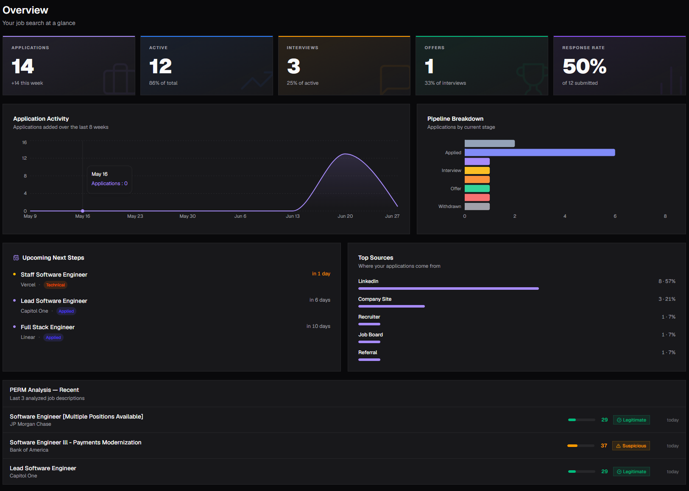
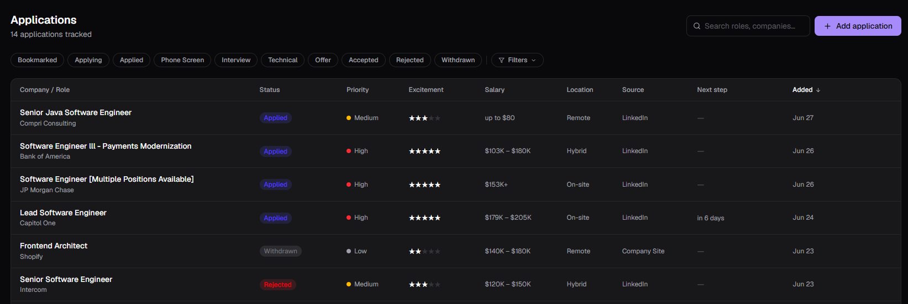
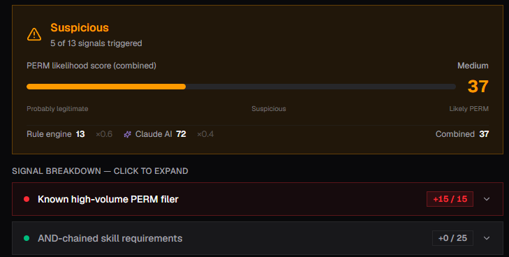
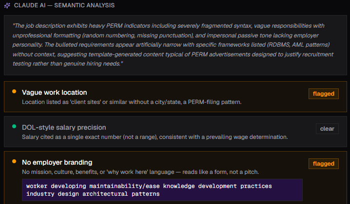

# Job Tracker

> Your job search, finally organized.

A full-stack job application tracker with AI-powered PERM analysis — helping you spot suspicious job postings designed for visa compliance rather than genuine hiring, before you invest time applying.

**Live demo:** https://job-tracker-pink-kappa-55.vercel.app

---

## Screenshots

### Overview Dashboard


### Job Applications


### PERM Likelihood Analysis


### Claude AI Semantic Analysis


---

## Features

- **Pipeline overview** — Stats at a glance: total applications, active roles, interview count, offer count, and response rate. Includes an 8-week activity chart, pipeline stage breakdown, top application sources, and upcoming next-step deadlines.
- **Job tracking** — Log applications with role, company, status, priority, excitement rating, salary range, location, source, and follow-up date. Filter by status (Bookmarked, Applying, Applied, Phone Screen, Interview, Technical, Offer, Accepted, Rejected, Withdrawn).
- **PERM likelihood scoring** — Paste a job description to get a combined PERM likelihood score (0–100) derived from two signals:
  - **Rule engine** — 13+ pattern-matching rules (known high-volume PERM filers, AND-chained skill requirements, DOL-style salary precision, missing employer branding, vague work location, etc.), each with weighted point values.
  - **Claude AI** — Semantic analysis that reads the JD holistically and scores it independently, then explains in plain English *why* the posting looks suspicious.
  - Scores are combined (rule engine ×0.6 + Claude ×0.4) into a verdict: **Probably Legitimate**, **Suspicious**, or **Likely PERM**.
- **Signal breakdown** — Every triggered rule is shown with its point contribution, expandable for detail. Claude's full reasoning is shown alongside flagged and cleared signals with quoted evidence from the JD.
- **Company & contact management** — Track companies and contacts, linked to their applications.
- **Analysis persistence** — AI results are saved per job. Delete the job without losing the analysis, or remove the analysis independently. Deep-link from the overview's recent PERM results directly to the full analysis.

---

## Tech Stack

| Layer | Technology |
|---|---|
| Framework | Next.js 15 (App Router, Server Actions) |
| Language | TypeScript |
| Auth + DB | Supabase (PostgreSQL) |
| ORM | Prisma |
| AI | Anthropic Claude (claude-haiku-4-5-20251001) |
| Styling | Tailwind CSS |
| Animations | Framer Motion |
| Deployment | Vercel |

---

## Getting Started

### Prerequisites

- Node.js 18+
- A [Supabase](https://supabase.com) project (free tier works)
- An [Anthropic API key](https://console.anthropic.com)

### 1. Clone and install

```bash
git clone https://github.com/your-username/job-tracker.git
cd job-tracker
npm install
```

### 2. Set up environment variables

Copy `.env.example` to `.env.local` and fill in your values:

```bash
cp .env.example .env.local
```

| Variable | Where to find it |
|---|---|
| `NEXT_PUBLIC_SUPABASE_URL` | Supabase → Project Settings → API |
| `NEXT_PUBLIC_SUPABASE_ANON_KEY` | Supabase → Project Settings → API |
| `DATABASE_URL` | Supabase → Project Settings → Database → Connection string (Transaction mode, port 6543) |
| `DIRECT_URL` | Supabase → Project Settings → Database → Connection string (Session mode, port 5432) |
| `ANTHROPIC_API_KEY` | [console.anthropic.com/settings/keys](https://console.anthropic.com/settings/keys) |

### 3. Run migrations

```bash
npx prisma migrate dev
```

### 4. Start the dev server

```bash
npm run dev
```

Open [http://localhost:3000](http://localhost:3000).

---

## Deployment

Designed to deploy on **Vercel** with zero config. Add all environment variables in Vercel → Project → Settings → Environment Variables, then push to `main`.

Supabase free tier is sufficient for personal use. Note: free Supabase projects pause after 1 week of inactivity (wakes on next request in ~30s).
